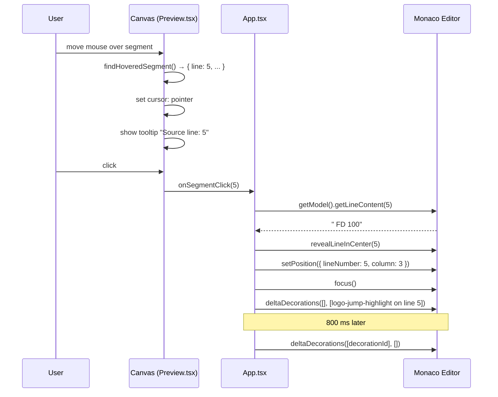

# Click Preview Segment to Jump to Source

## Summary

When the user clicks a rendered segment in the preview canvas, the Monaco editor navigates directly to the source line that produced that segment: the cursor lands on the first non-whitespace character, the line is scrolled into centre view, a brief highlight decoration draws the eye, and keyboard focus transfers to the editor. Segments with no source line information are not clickable. The feature works regardless of whether the animation is playing.

## Detailed description

### Hover-to-click upgrade

The preview already tracks a `hoveredSegment` via `findHoveredSegment()` (hit-tested with an 8 px radius) and displays a tooltip showing the source line number. This feature extends that surface by:

1. **Changing the canvas cursor** to `pointer` whenever `hoveredSegment` is non-null, signalling that the segment is interactive.
2. **Adding a click handler** on the canvas that reads `hoveredSegment.line` and fires an `onSegmentClick` callback if the line number is greater than zero.

### Editor navigation (App.tsx)

`App` receives the `onSegmentClick(lineNumber: number)` callback and drives the Monaco editor via `editorRef.current`:

1. Get the model and read the content of the target line.
2. Compute the first non-whitespace column (`lineContent.search(/\S/) + 1`, clamped to 1 if the line is blank or all-whitespace).
3. Call `editor.revealLineInCenter(lineNumber)` to scroll the line into centre view.
4. Call `editor.setPosition({ lineNumber, column })` to place the cursor.
5. Call `editor.focus()` to steal keyboard focus from the canvas.
6. Apply a whole-line decoration with class `logo-jump-highlight` using `editor.deltaDecorations`, then remove it after 800 ms via `setTimeout`.

The jump decoration is tracked independently of the existing `decorationsRef` (used for error highlights) so the two do not interfere.

### Edge cases

- **Segment with `sourceLine` of `0` or `undefined`**: `onSegmentClick` is not called; the click is silently ignored.
- **Line number out of range**: if `lineNumber` exceeds the model's line count (shouldn't happen in practice), navigation is skipped.
- **Editor not mounted**: if `editorRef.current` is null, the callback returns early with no side-effects.
- **Animation playing**: click handling is unconditional — the animation state is not checked and continues unaffected.

### CSS highlight

`.logo-jump-highlight` is defined in `src/index.css` with a background colour and a CSS fade-out animation (e.g. `animation: jumpFade 0.8s ease-out forwards`). The colour should be distinct from the existing error highlight (`--t2os-error-line-bg`) and work on both light and dark editor themes. A neutral warm yellow with low opacity works for both.

## User stories

- As a Logo programmer, I want to click a segment in the preview and land directly on the line that drew it, so that I can edit or inspect the command without manually searching.
- As a Logo programmer, I want the editor to flash the jumped-to line briefly, so that I don't lose my place after the scroll.

## Key decisions

| Decision | Outcome |
|---|---|
| Focus behaviour | Click steals keyboard focus from the canvas and gives it to the Monaco editor |
| Cursor column | First non-whitespace character of the target line, not column 1 |
| Transient highlight | Yes — whole-line `logo-jump-highlight` decoration removed after 800 ms |
| Segments with no source line | Do nothing on click; cursor change and click handler are suppressed for `line === 0` or `undefined` |
| Works during animation | Yes — animation state is not consulted and continues unaffected |
| Canvas cursor signal | `cursor: pointer` when `hoveredSegment` is non-null, `cursor: default` otherwise |
| Decoration isolation | Jump decoration tracked separately from `decorationsRef` (error decorations) to avoid interference |

## Diagrams



## Acceptance criteria

```gherkin
Feature: Click preview segment to jump to source line

  Background:
    Given the application is loaded
    And a multi-line Logo script has been executed
    And the preview canvas shows rendered segments

  Scenario: Clicking a hittable segment moves the cursor to its source line
    Given the user hovers over a segment whose tooltip shows "Source line: 5"
    When the user clicks the segment
    Then the Monaco editor cursor is on line 5
    And the cursor column is the first non-whitespace character of line 5

  Scenario: Clicking a segment scrolls the line into centre view
    Given line 5 is scrolled out of view in the Monaco editor
    When the user clicks a segment from source line 5
    Then the editor scrolls so that line 5 is visible and approximately centred

  Scenario: Clicking a segment steals keyboard focus
    When the user clicks a segment
    Then keyboard focus is in the Monaco editor
    And pressing an arrow key moves the editor cursor, not the canvas focus

  Scenario: A transient highlight appears on the jumped-to line
    When the user clicks a segment from source line 5
    Then line 5 is decorated with a highlight background
    And the highlight decoration disappears after approximately 800 ms

  Scenario: Canvas cursor is a pointer over a hittable segment
    When the user moves the mouse over a hittable segment
    Then the canvas cursor is "pointer"

  Scenario: Canvas cursor reverts when not over a segment
    Given the user was hovering a hittable segment
    When the user moves the mouse to an area with no segment within hit radius
    Then the canvas cursor reverts to "default"

  Scenario: Clicking a segment with no source line does nothing
    Given there is a segment with sourceLine of 0 or undefined
    When the user clicks that segment
    Then the Monaco editor cursor does not move
    And no highlight decoration is applied

  Scenario: Click works while the animation is playing
    Given the animation is currently playing
    When the user clicks a hittable segment from source line 3
    Then the Monaco editor cursor moves to line 3
    And the animation continues playing without interruption

  Scenario: Clicking with editor not yet mounted does nothing
    Given the Monaco editor ref is null
    When onSegmentClick is called with a valid line number
    Then no error is thrown and no side effects occur
```

## Manual test steps

1. Open the application and enter a Logo script with at least 6 commands, each on its own line (e.g. `FD 50`, `RT 90`, `FD 50`, `RT 90`, `FD 50`, `RT 90`). Run the script.
2. Hover over a segment in the preview canvas and confirm the tooltip shows a source line number.
3. While hovering, confirm the cursor changes to a hand/pointer icon.
4. Move the mouse off all segments and confirm the cursor reverts to the default arrow.
5. Click the segment. Confirm the Monaco editor cursor jumps to the line shown in the tooltip.
6. Confirm the cursor column is on the first non-whitespace character of that line (not necessarily column 1).
7. Confirm a highlight briefly flashes on that line in the editor, then disappears within about a second.
8. Confirm that keyboard focus is now in the editor — press the Down arrow and verify the cursor moves down by one line in the editor.
9. Scroll the editor away from the target line so it is off-screen. Click a segment for that line. Confirm the editor scrolls to bring the line into view near the centre.
10. Start playback (play button). While the animation is running, click a segment. Confirm the cursor jumps to the correct source line and the animation keeps running.
11. Verify behaviour in both light and dark themes: the jump highlight should be visible but not clash with error highlights.

## Implementation tasks

Tasks must be completed in order as each depends on the previous.

1. **Add `onSegmentClick` prop to `Preview.tsx`** (`src/components/Preview.tsx`):
   - Add `onSegmentClick?: (lineNumber: number) => void` to the props interface (alongside existing `onPlay`, `onPause`, etc.)
   - Add an `onClick` handler on the `<canvas>` element: if `hoveredSegment` is non-null and `hoveredSegment.line > 0`, call `onSegmentClick(hoveredSegment.line)`
   - Update the canvas `style` to set `cursor: hoveredSegment ? 'pointer' : 'default'` (this replaces any existing static cursor value)

2. **Add `handleSegmentClick` callback in `App.tsx`** (`src/App.tsx`):
   - Add a `useCallback` handler `handleSegmentClick(lineNumber: number)`:
     - Guard: return early if `editorRef.current` or `monacoRef.current` is null
     - Guard: return early if `lineNumber <= 0`
     - Get the model via `editor.getModel()`; return early if null
     - Read `model.getLineContent(lineNumber)`, compute first non-whitespace column (`Math.max(1, content.search(/\S/) + 1)`)
     - Call `editor.revealLineInCenter(lineNumber)`
     - Call `editor.setPosition({ lineNumber, column })`
     - Call `editor.focus()`
     - Apply whole-line decoration: `editor.deltaDecorations([], [{ range: new monaco.Range(lineNumber, 1, lineNumber, 1), options: { isWholeLine: true, className: 'logo-jump-highlight' } }])` — store returned IDs in a local `const`
     - Call `setTimeout(() => editor.deltaDecorations(ids, []), 800)` to remove the decoration

3. **Wire the callback to `<Preview>` in `App.tsx`** (`src/App.tsx`, lines ~345–355):
   - Pass `onSegmentClick={handleSegmentClick}` to the `<Preview>` component

4. **Add highlight CSS in `src/index.css`**:
   - Define `@keyframes jumpFade` that animates `background-color` from a warm semi-transparent yellow (e.g. `rgba(255, 220, 50, 0.35)`) to transparent
   - Define `.logo-jump-highlight` with `animation: jumpFade 0.8s ease-out forwards`
   - Verify the colour is readable in both `vs-dark` and `vs-light` editor themes and does not conflict with the existing `.t2osLineError` style (line 72–74 of `src/index.css`)
