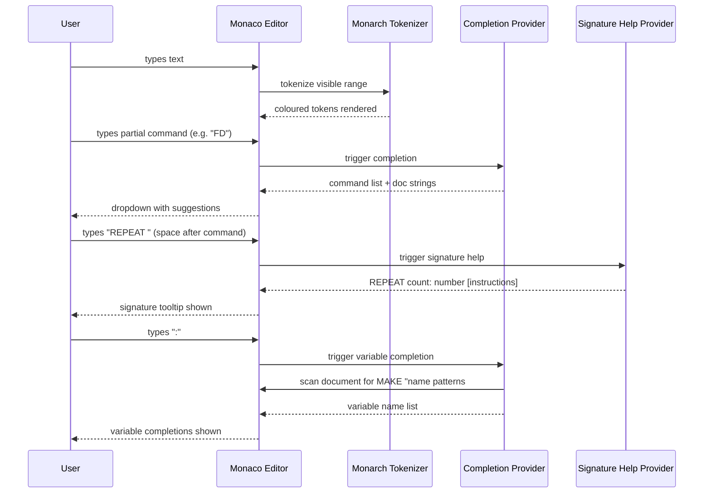

# Monaco Syntax Highlighting

## Summary

Register a custom Monaco language mode (`"logo"`) for the Logo scripting language used in logo2openscad, replacing the current `plaintext` mode. The language mode adds colour-coded syntax highlighting for commands, variables, bracketed strings, numeric literals, expression built-ins, and comments. Autocomplete is provided for all known commands (with inline signature documentation) and for variable names defined in the current document. The read-only OpenSCAD output editor is also upgraded from `plaintext` to a custom `"openscad"` language mode with full OpenSCAD syntax highlighting.

## Detailed description

### Logo language registration

A new Monaco language ID `"logo"` is registered once, before any editor instance mounts, using the `beforeMount` prop from `@monaco-editor/react`. A Monarch tokenizer defines the following token rules, evaluated in priority order:

| Token type | Syntax | Example |
|---|---|---|
| `logo.comment` | `#` or `//` to end of line | `# turn left` |
| `logo.comment` | `/* ... */` block | `/* multi-line */` |
| `logo.command` | Any known command keyword (case-insensitive) | `FD`, `REPEAT`, `MAKE` |
| `logo.builtin` | Expression function keyword (case-insensitive) | `SQRT`, `EXTGETX` |
| `logo.variable` | `:identifier` | `:myVar` |
| `logo.string` | `"identifier` (quoted name in MAKE) | `"distance` |
| `logo.string` | `[...]` bracketed block | `[FD 10 RT 90]` |
| `logo.number` | Integer or decimal literal | `100`, `3.14` |

Commands are matched case-insensitively. The full command list is:

`FD`, `FORWARD`, `BK`, `BACK`, `HOME`, `LT`, `LEFT`, `RT`, `RIGHT`, `SETH`, `SETHEADING`, `SETX`, `SETY`, `SETXY`, `PU`, `PENUP`, `PD`, `PENDOWN`, `ARC`, `MAKE`, `REPEAT`, `CALL`, `PRINT`, `EXTCOMMENTPOS`, `EXTMARKER`, `EXTSETFN`, `EXTBEZIERCURVE`, `EXTDEFCONTROLPOINT`, `EXTSCALE`

Expression built-ins are: `SQRT`, `LN`, `EXP`, `LOG10`, `EXTGETX`, `EXTGETY`, `EXTGETH`

Bracketed blocks `[...]` may span multiple lines (e.g. `REPEAT` bodies). The Monarch tokenizer handles this with a push/pop state transition so the interior of a block is correctly coloured as a string across lines.

### Theme colours

Custom token colour rules are registered for both `vs-dark` and `vs-light` via `monaco.editor.defineTheme`, extending each base theme. The same six semantic roles are coloured in both themes, with light- and dark-appropriate palette values.

| Token | Role |
|---|---|
| `logo.comment` | Comment (muted) |
| `logo.command` | Keyword (primary accent) |
| `logo.builtin` | Function (secondary accent) |
| `logo.variable` | Variable (info/cyan) |
| `logo.string` | String literal (warm) |
| `logo.number` | Number literal (numeric accent) |

### Autocomplete

A `CompletionItemProvider` is registered for `"logo"`. It produces two categories of suggestion:

**Command completions** — offered for any word token that could be a command:
- All 27+ commands, with `kind: Keyword`
- Each entry includes a `documentation` string describing what the command does and its expected arguments

**Variable completions** — offered when the cursor is at a `:` prefix:
- The current document is scanned for `MAKE "varname` patterns (case-insensitive)
- Each matched name is offered as `:varname` with `kind: Variable`
- The scan runs on the current model value at completion time, so newly-typed variables are included without requiring a re-parse

### Signature help

A `SignatureHelpProvider` is registered for `"logo"`. It is triggered by a space character after a known command. Each command has a defined signature with parameter labels, e.g.:

| Command | Signature |
|---|---|
| `FD` / `FORWARD` | `FD distance: number` |
| `LT` / `LEFT` | `LT degrees: number` |
| `REPEAT` | `REPEAT count: number [instructions]` |
| `MAKE` | `MAKE "name value` |
| `ARC` | `ARC angle: number, radius: number` |
| `SETXY` | `SETXY x: number, y: number` |
| `EXTBEZIERCURVE` | `EXTBEZIERCURVE steps: number [instructions]` |
| `EXTSCALE` | `EXTSCALE factor: number, [instructions]` |
| `PRINT` | `PRINT [text], ...values` |

Commands with no parameters (e.g. `HOME`, `PU`, `PD`) do not register a signature.

### OpenSCAD language registration

A new Monaco language ID `"openscad"` is registered. OpenSCAD is not included in Monaco's bundled language set, so a custom Monarch tokenizer is required. Key token categories:

| Token type | Examples |
|---|---|
| `openscad.comment` | `//`, `/* */` |
| `openscad.keyword` | `module`, `function`, `for`, `if`, `else`, `let`, `each`, `true`, `false`, `undef` |
| `openscad.shape` | `sphere`, `cube`, `cylinder`, `polyhedron`, `circle`, `square`, `polygon`, `text`, `surface`, `import` |
| `openscad.operation` | `union`, `difference`, `intersection`, `hull`, `minkowski`, `render`, `linear_extrude`, `rotate_extrude`, `projection`, `offset`, `color` |
| `openscad.special` | `$fn`, `$fa`, `$fs`, `$t`, `$vpr`, `$vpt`, `$vpd`, `$vpf`, `$children`, `$preview` |
| `openscad.string` | `"..."` |
| `openscad.number` | Integer and decimal literals |

Theme colours for both `vs-dark` and `vs-light` are registered alongside the Logo theme tokens.

## User stories

- As a Logo programmer, I want commands like `FD` and `REPEAT` to appear in a distinct colour so that I can visually parse the structure of my script at a glance.
- As a Logo programmer, I want variables like `:myVar` to be highlighted so that I can immediately distinguish data from instructions.
- As a Logo programmer, I want autocomplete suggestions when I start typing a command name so that I don't need to memorise exact spellings.
- As a Logo programmer, I want to see parameter hints when I type a command name and press space so that I know what arguments are expected without leaving the editor.
- As a Logo programmer, I want `:varname` autocomplete to include variables I just defined in the current session so that I don't mistype variable names mid-script.
- As a user, I want the OpenSCAD output to have proper syntax colouring so that I can read and verify the generated code more easily.

## Key decisions

| Decision | Outcome |
|---|---|
| EXT* commands vs core commands | All commands share the same `logo.command` colour — no distinction between core and extension commands |
| Expression built-ins colour | Distinct `logo.builtin` colour, separate from commands |
| `"varname` after MAKE | Treated as a string literal (`logo.string`), same colour as bracketed strings |
| Numeric literals | Distinct `logo.number` colour |
| Theme support | Both `vs-dark` and `vs-light` custom theme tokens defined |
| Autocomplete variable scanning | Scan the current model value at completion time; no dependency on the parse result |
| Autocomplete trigger for variables | Provider triggers on `:` so only variable completions are shown in that context |
| Signature help | In scope; triggered on space after a command keyword |
| OpenSCAD highlighting | In scope; requires a custom Monarch tokenizer (OpenSCAD is not bundled in Monaco) |
| Language registration timing | Registration happens once in the `beforeMount` callback of `LogoEditor`; a module-level flag prevents duplicate registration when editors remount |

## Diagrams



## Acceptance criteria

```gherkin
Feature: Logo syntax highlighting

  Background:
    Given the application is loaded
    And the Logo editor is visible

  Scenario: Commands are highlighted
    When the user types "FD 100"
    Then the token "FD" is rendered with the command colour

  Scenario: Command matching is case-insensitive
    When the user types "fd 100"
    Then the token "fd" is rendered with the command colour

  Scenario: Extension commands share the command colour
    When the user types "EXTSCALE 2, [FD 10]"
    Then "EXTSCALE" is rendered with the command colour

  Scenario: Expression built-ins are highlighted distinctly
    When the user types "MAKE \"r SQRT :x"
    Then "SQRT" is rendered with the built-in colour
    And "SQRT" colour differs from the command colour

  Scenario: Variables are highlighted
    When the user types ":myVar"
    Then ":myVar" is rendered with the variable colour

  Scenario: Quoted names are treated as string literals
    When the user types "MAKE \"distance 100"
    Then "\"distance" is rendered with the string colour

  Scenario: Bracketed blocks are highlighted as strings
    When the user types "REPEAT 4 [FD 10 RT 90]"
    Then "[FD 10 RT 90]" is rendered with the string colour

  Scenario: Numeric literals are highlighted
    When the user types "FD 3.14"
    Then "3.14" is rendered with the number colour

  Scenario: Hash comments are highlighted
    When the user types "# this is a comment"
    Then the entire line is rendered with the comment colour

  Scenario: Slash-slash comments are highlighted
    When the user types "FD 100 // move forward"
    Then "// move forward" is rendered with the comment colour

  Scenario: Block comments are highlighted
    When the user types a "/* comment */" spanning multiple lines
    Then all text between "/*" and "*/" is rendered with the comment colour

  Scenario: Highlighting applies in vs-dark theme
    Given the theme is set to dark
    Then all token categories are rendered with their configured dark-theme colours

  Scenario: Highlighting applies in vs-light theme
    Given the theme is set to light
    Then all token categories are rendered with their configured light-theme colours

Feature: Logo autocomplete

  Scenario: Command completions are offered
    When the user types "FD" and triggers autocomplete
    Then a completion item "FD" appears in the suggestion list
    And the item includes documentation describing the command

  Scenario: Autocomplete includes all known commands
    When the user triggers autocomplete in an empty script
    Then completion items exist for all 27+ commands

  Scenario: Variable completions are offered after colon
    Given the user has typed "MAKE \"speed 5" on a previous line
    When the user types ":"
    Then a completion item ":speed" appears in the suggestion list

  Scenario: Variable completions reflect current document state
    Given the user types "MAKE \"angle 45" and then types ":"
    Then ":angle" appears as a completion without requiring a save or rebuild

Feature: Logo signature help

  Scenario: Signature hint appears after command and space
    When the user types "FD " (with a trailing space)
    Then a signature tooltip appears showing "FD distance: number"

  Scenario: Signature hint appears for multi-parameter command
    When the user types "ARC "
    Then a signature tooltip shows "ARC angle: number, radius: number"

  Scenario: Commands with no parameters do not show a signature hint
    When the user types "HOME "
    Then no signature tooltip appears

Feature: OpenSCAD syntax highlighting

  Background:
    Given the application is loaded
    And the OpenSCAD output editor is visible

  Scenario: OpenSCAD keywords are highlighted
    When the output contains "module myShape()"
    Then "module" is rendered with the keyword colour

  Scenario: OpenSCAD built-in shapes are highlighted
    When the output contains "sphere(r = 5)"
    Then "sphere" is rendered with the shape colour

  Scenario: OpenSCAD operations are highlighted
    When the output contains "union() {"
    Then "union" is rendered with the operation colour

  Scenario: OpenSCAD special variables are highlighted
    When the output contains "$fn = 32"
    Then "$fn" is rendered with the special variable colour

  Scenario: OpenSCAD strings are highlighted
    When the output contains "text(\"hello\")"
    Then "\"hello\"" is rendered with the string colour

  Scenario: OpenSCAD comments are highlighted
    When the output contains "// generated by logo2openscad"
    Then the comment text is rendered with the comment colour
```

## Manual test steps

1. Open the application.
2. Type `FD 100` in the Logo editor — verify `FD` appears in a colour distinct from `100`.
3. Type `fd 100` in lowercase — verify it is coloured the same as `FD`.
4. Type `EXTSCALE 2, [FD 10]` — verify `EXTSCALE` matches the colour of `FD`.
5. Type `MAKE "distance SQRT :x` — verify `SQRT` appears in a different colour from `MAKE`.
6. Type `:myVar` — verify it appears in the variable colour.
7. Type `MAKE "speed 5` then on the next line type `:` — verify `:speed` appears in the autocomplete dropdown.
8. Type `# comment here` — verify the whole line is greyed/muted.
9. Type `FD 100 // inline comment` — verify only the comment portion is muted.
10. Type a multi-line `/* block comment */` — verify both lines inside the block are muted.
11. Type `REPEAT 4 [FD 10 RT 90]` — verify the bracketed block is coloured as a string.
12. Type `3.14` as an argument — verify the number is coloured distinctly.
13. Type `FD ` (with a space) — verify a signature tooltip appears showing the `distance` parameter.
14. Type `HOME ` — verify no signature tooltip appears.
15. Switch the editor to light theme — verify all colours remain readable and distinct.
16. Generate any OpenSCAD output — verify `module`, `sphere`, `union`, `$fn`, string literals, and comments are each coloured distinctly in the output editor.

## Implementation tasks

1. **Create `src/monaco/` directory** and add an `index.ts` barrel file that exports `registerLogoLanguage` and `registerOpenScadLanguage`.

2. **Create `src/monaco/logoLanguage.ts`**:
   - Call `monaco.languages.register({ id: 'logo' })`
   - Define and call `monaco.languages.setMonarchTokensProvider('logo', ...)` with rules for all token types listed in the detailed description; handle multi-line `[...]` blocks with a push/pop tokenizer state
   - Call `monaco.editor.defineTheme('logo-dark', ...)` extending `vs-dark` with `logo.*` token colours
   - Call `monaco.editor.defineTheme('logo-light', ...)` extending `vs-light` with `logo.*` token colours
   - Register a `CompletionItemProvider` that (a) returns all commands on any word trigger and (b) returns `:varname` completions scanned from `MAKE "name` patterns in the model value when the trigger character is `:`
   - Register a `SignatureHelpProvider` triggered on `' '` that maps the preceding command keyword to its parameter signature

3. **Create `src/monaco/openscadLanguage.ts`**:
   - Call `monaco.languages.register({ id: 'openscad' })`
   - Define Monarch tokenizer for OpenSCAD tokens listed in the detailed description
   - Add `openscad.*` token colour rules to the `logo-dark` and `logo-light` themes (or define separate `openscad-dark` / `openscad-light` themes if the editors always use different themes)

4. **Update `src/components/LogoEditor.tsx`** (line 54–66):
   - Add a `beforeMount` prop to the `<Editor>` component
   - In `beforeMount`, call `registerLogoLanguage(monaco)` guarded by a module-level `registered` boolean
   - Change `defaultLanguage="plaintext"` to `defaultLanguage="logo"`
   - Update the `theme` prop to pass `"logo-dark"` or `"logo-light"` instead of `"vs-dark"` / `"vs-light"`

5. **Update `src/components/OpenScadEditor.tsx`** (lines 32–34, 54+):
   - Add a `beforeMount` prop that calls `registerOpenScadLanguage(monaco)` with the same guard pattern
   - Change `language="plaintext"` to `language="openscad"`
   - Update the `theme` prop to use `"logo-dark"` or `"logo-light"` (so OpenSCAD token colours are included)

6. **Verify no duplicate registrations** — confirm both editors share the same registered flag so remounting either editor does not re-register providers.

7. **Manual smoke test** — follow the manual test steps above to verify all token categories and both themes.
