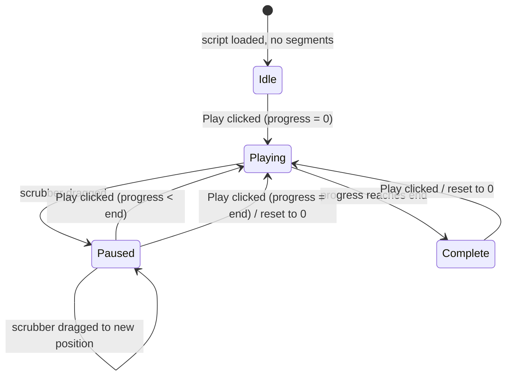
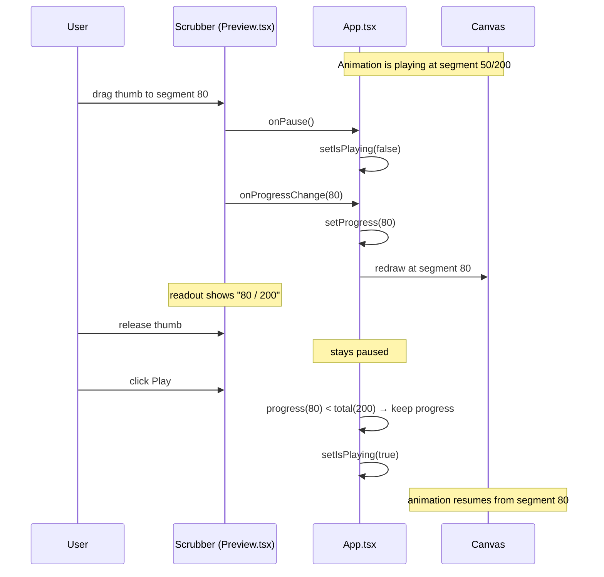

# Preview Scrubber Timeline

## Summary

Replace the Pause button with a draggable progress scrubber below the preview canvas, giving users direct, manual control over the animation position — like a video timeline. The Play button remains and resumes from the scrubber's current position (or restarts from the beginning if the animation has already completed). Dragging the scrubber automatically pauses playback and leaves it paused on release. A numeric readout displays the current segment count alongside the slider.

## Detailed description

### Controls layout

The existing controls panel in `Preview.tsx` currently has two rows below the canvas:

1. **Top row**: checkbox controls (Hide PU etc.) + Play + Pause buttons
2. **Bottom row**: Speed label + Speed slider + speed value readout

After this feature the layout becomes:

1. **Top row**: checkbox controls + Play button *(Pause button removed)*
2. **Middle row** *(new)*: scrubber slider + segment readout (e.g. `47 / 200`)
3. **Bottom row**: Speed label + Speed slider + speed value readout

### Scrubber slider

An MUI `<Slider>` component is added, following the exact same pattern as the existing speed slider (Preview.tsx:176–187). Its properties:

- `min={0}`, `max={props.activeSegments.length}`, `step={1}`
- `value={Math.floor(props.progress)}`
- `disabled={!props.hasSegments}`
- `onChange`: if `props.isPlaying`, call `props.onPause()` first; then call `props.onProgressChange(value)` with the new integer position

Using `step={1}` means the slider snaps to whole-segment boundaries, which matches the natural granularity of the Logo drawing model. The canvas re-renders on every progress update via the existing `useEffect` dependency on `progress` (Preview.tsx:112).

### Numeric readout

A `<Typography>` element to the right of the slider shows `{Math.floor(props.progress)} / {props.activeSegments.length}`. When there are no segments (script not yet run), it shows `0 / 0`. This mirrors the style of the existing speed readout at Preview.tsx:184–186.

### Play button behaviour change

Currently `handlePlay` in `App.tsx` always resets `progress` to `0`. The new behaviour:

- If `progress >= activeSegments.length` (animation at or past the end): reset `progress` to `0`, then set `isPlaying = true`
- Otherwise: leave `progress` unchanged, set `isPlaying = true`

`setActiveSegments(runResult.segments)` and `lastTsRef.current = null` are still called in both branches to ensure segments are fresh and RAF timing is reset correctly.

`startPreviewFromRef` (called by Ctrl+Enter / Ctrl+S) is **not** changed — it always resets to 0, because those shortcuts mean "re-run from the top", not "resume".

### Pause behaviour

`handlePause` remains in `App.tsx` unchanged. The Pause button is removed from the UI but `onPause` is still passed to `<Preview>` as a prop so the scrubber's `onChange` handler can call it internally. No external-facing Pause button or keyboard shortcut replaces the removed button.

### Edge cases

- **Scrubbing past the end**: the slider's `max` equals `activeSegments.length`, so it cannot exceed the total. The existing clamp in `drawPreview.ts:101` provides a second safety net.
- **Empty segment array**: slider is `disabled`, readout shows `0 / 0`, Play is disabled — identical to current behaviour.
- **Auto-play on script switch**: the `useEffect` at App.tsx:116–125 always resets progress to `0` and auto-plays. This behaviour is unchanged.
- **Progress floating point**: `Math.floor(props.progress)` is used for both the slider `value` and the readout so mid-segment fractional state (produced by the animation loop) doesn't cause slider jitter.

## User stories

- As a Logo programmer, I want to drag a timeline slider to any point in my animation so that I can inspect the drawing state at a specific step without watching it play through.
- As a Logo programmer, I want the animation to pause automatically when I grab the scrubber so that it doesn't fight me while I'm positioning it.
- As a Logo programmer, I want Play to resume from where I left off rather than always starting over so that I can step to a region of interest and then watch from there.

## Key decisions

| Decision | Outcome |
|---|---|
| Pause button fate | Removed entirely; dragging the scrubber is the only way to pause mid-playback |
| Scrub release behaviour | Stays paused — the user must press Play to resume |
| Play at end of animation | Resets to 0 and plays; at any other position, resumes from current position |
| Slider granularity | `step={1}` — whole segments only; fractional progress from the animation loop is floored for display |
| Numeric readout format | `X / Y` where X = `Math.floor(progress)` and Y = `activeSegments.length` |
| Ctrl+Enter / Ctrl+S shortcuts | Unchanged — always restart from 0 |
| `onPause` prop | Kept on PreviewProps (used internally by scrubber onChange); no Pause button in the UI |

## Diagrams





## Acceptance criteria

```gherkin
Feature: Preview scrubber timeline

  Background:
    Given a Logo script has been run
    And the preview shows rendered segments

  Scenario: Scrubber thumb reflects current animation progress
    Given the animation is playing
    When the animation advances to segment 50 of 200
    Then the scrubber thumb is positioned at 50 of 200
    And the readout shows "50 / 200"

  Scenario: Scrubber is disabled before any script runs
    Given no script has been run yet
    Then the scrubber is disabled
    And the readout shows "0 / 0"

  Scenario: Dragging the scrubber pauses the animation
    Given the animation is playing
    When the user drags the scrubber thumb
    Then the animation pauses immediately
    And the canvas updates to show the frame at the dragged position

  Scenario: Releasing the scrubber keeps the animation paused
    Given the user has dragged the scrubber to segment 80
    When the user releases the scrubber
    Then the animation remains paused at segment 80
    And the readout shows "80 / 200"

  Scenario: Play resumes from current position when not at end
    Given the animation is paused at segment 80 of 200
    When the user clicks Play
    Then the animation resumes from segment 80
    And does not jump back to the beginning

  Scenario: Play restarts from 0 when animation is complete
    Given the animation has completed (progress equals total segments)
    When the user clicks Play
    Then progress resets to 0
    And the animation plays from the beginning

  Scenario: Play is disabled while the animation is playing
    Given the animation is currently playing
    Then the Play button is disabled

  Scenario: Pause button is not present
    Then no Pause button is visible in the preview controls

  Scenario: Scrubbing to a specific segment shows that frame
    Given the animation is paused
    When the user drags the scrubber to segment 10
    Then the canvas shows exactly 10 complete segments drawn

  Scenario: Ctrl+Enter always restarts from the beginning
    Given the animation is paused at segment 80
    When the user presses Ctrl+Enter
    Then progress resets to 0
    And the animation plays from the beginning

  Scenario: Scrubber does not exceed total segment count
    When the user drags the scrubber to its rightmost position
    Then the readout shows "N / N" where N is the total segment count
    And the canvas shows all segments drawn
```

## Manual test steps

1. Open the application, type a multi-line Logo script (e.g. 10+ `FD`/`RT` commands), and run it with Ctrl+Enter.
2. Confirm the animation begins playing and the Pause button is **not** present.
3. While the animation is playing, confirm the scrubber thumb moves to the right and the readout updates (e.g. "12 / 48").
4. While playing, grab the scrubber thumb and drag it to the left. Confirm the animation pauses immediately and the canvas jumps to the dragged position.
5. Release the thumb. Confirm the animation remains paused and the readout shows the correct position.
6. Click Play. Confirm the animation resumes from the position the scrubber was left at (not from the beginning).
7. Let the animation run to completion. Confirm it stops at the end and the readout shows "N / N".
8. Click Play again. Confirm the animation restarts from the beginning (readout goes back to "0 / N" and animates forward).
9. Drag the scrubber to a mid-point while paused. Confirm the canvas shows exactly that many segments drawn.
10. Drag the scrubber all the way to the left (position 0). Confirm the canvas is blank (no segments drawn) and the readout shows "0 / N".
11. Drag the scrubber all the way to the right. Confirm all segments are drawn and the readout shows "N / N".
12. Press Ctrl+Enter while the scrubber is mid-way. Confirm the animation resets to 0 and plays from the beginning.
13. Before running any script, confirm the scrubber is disabled and the readout shows "0 / 0".

## Implementation tasks

Tasks must be completed in order.

1. **Add `onProgressChange` prop to `PreviewProps` in `Preview.tsx`** (`src/components/Preview.tsx`, lines 11–21):
   - Add `onProgressChange: (progress: number) => void` to the interface

2. **Update the controls JSX in `Preview.tsx`** (lines 148–188):
   - Remove the Pause `<Button>` (lines 158–166)
   - After the Play/controls `<Stack>` and before the Speed row `<Box>`, insert a new `<Box sx={{ px: 2, py: 1 }}>` containing a `<Stack direction="row" spacing={2} alignItems="center">` with:
     - A `<Slider>` with `min={0}`, `max={props.activeSegments.length}`, `step={1}`, `value={Math.floor(props.progress)}`, `disabled={!props.hasSegments}`, `sx={{ flex: 1 }}`
     - `onChange={(_, v) => { const val = Array.isArray(v) ? v[0] : v; if (props.isPlaying) props.onPause(); props.onProgressChange(val); }}`
     - A `<Typography variant="body2" sx={{ minWidth: 60, textAlign: 'right' }}>` showing `` `${Math.floor(props.progress)} / ${props.activeSegments.length}` ``
   - Wrap the new row in a `<Divider />` above it, following the existing pattern at line 170

3. **Add `handleProgressChange` callback in `App.tsx`**:
   - Add `const handleProgressChange = useCallback((value: number) => { setProgress(value) }, [])` alongside the existing handlers (around lines 96–105)

4. **Modify `handlePlay` in `App.tsx`** (lines 96–101):
   - Remove the unconditional `setProgress(0)` call
   - Replace with: `if (progress >= runResult.segments.length) setProgress(0)`
   - Keep `setActiveSegments(runResult.segments)`, `lastTsRef.current = null`, and `setIsPlaying(true)` unchanged
   - Wrap in `useCallback` with `[progress, runResult.segments]` as dependencies if not already, to ensure the closure captures the current `progress`

5. **Wire `onProgressChange` to `<Preview>` in `App.tsx`** (lines ~345–360):
   - Pass `onProgressChange={handleProgressChange}` to the `<Preview>` component

6. **Manual smoke test** — follow the manual test steps above.
