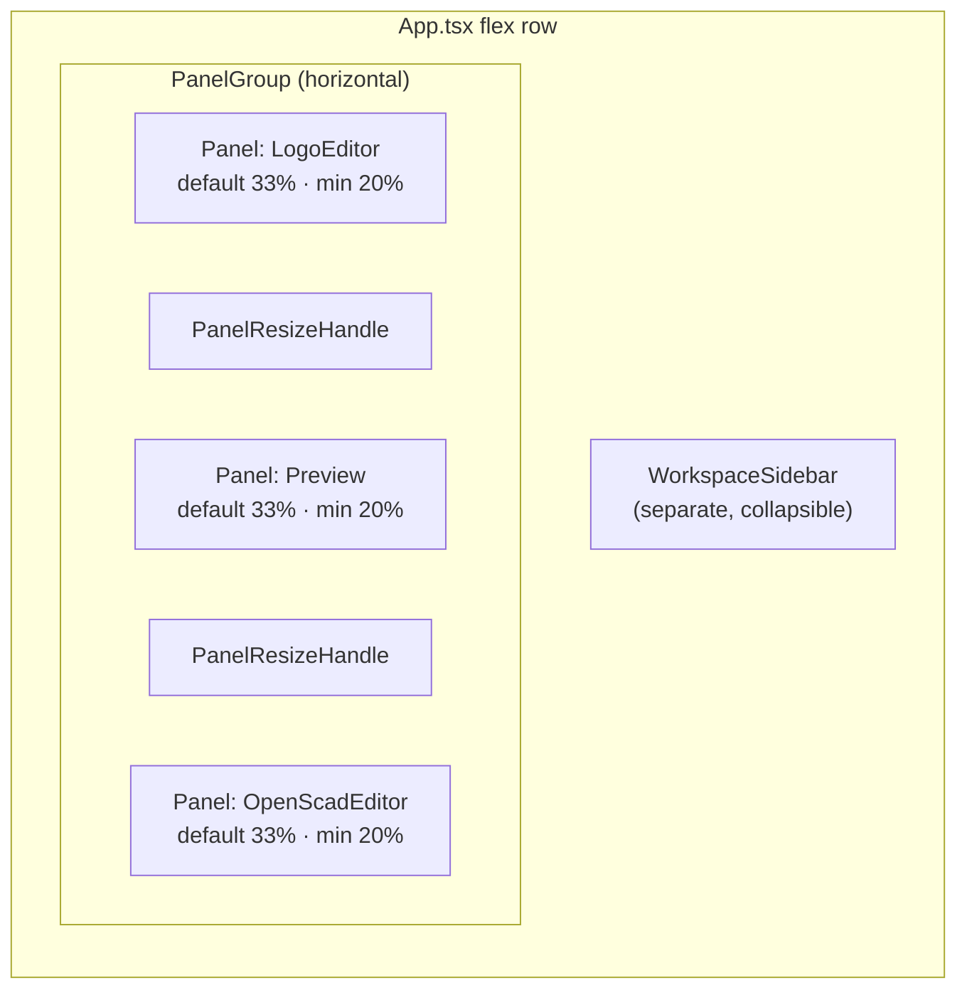
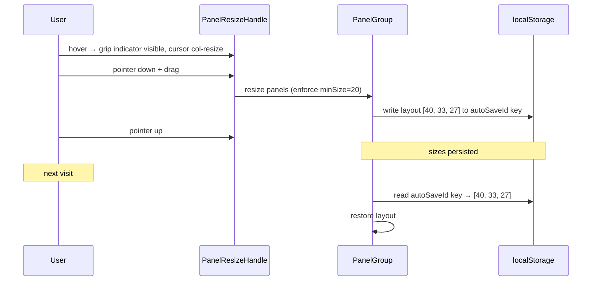

# Resizable Panels

## Summary

Replace the fixed equal-width three-pane layout (Logo editor / preview / OpenSCAD output) with draggable resize handles using `react-resizable-panels`. Each pane has a minimum width of 20% of the viewport. The user's chosen widths are persisted to localStorage and restored on next visit. A "Reset panel sizes" button in the Settings dialog restores equal thirds. Resize handles show a subtle grip indicator on hover. When the workspace sidebar opens, pane width ratios remain proportional.

## Detailed description

### Library choice

`react-resizable-panels` is added as a dependency. It provides three components:

- **`PanelGroup`** — wraps all panels; takes `direction="horizontal"` and `autoSaveId` for automatic localStorage persistence
- **`Panel`** — each resizable pane; takes `defaultSize` (percentage of group), `minSize` (percentage), and `id`
- **`PanelResizeHandle`** — the interactive drag handle between panels

Using percentages means pane ratios are naturally maintained when the sidebar opens or the viewport resizes — no additional logic is needed.

### Layout replacement

The current layout in `App.tsx` (lines ~284–370) has three sibling `<Box>` components each with `flex: 1`, separated by MUI `<Divider orientation="vertical" flexItem />` elements. These are replaced by:

```
<PanelGroup direction="horizontal" autoSaveId="logo2openscad-panels">
  <Panel id="editor"   defaultSize={33.33} minSize={20}>  <LogoEditor />   </Panel>
  <PanelResizeHandle />   {/* grip handle 1 */}
  <Panel id="preview"  defaultSize={33.33} minSize={20}>  <Preview />      </Panel>
  <PanelResizeHandle />   {/* grip handle 2 */}
  <Panel id="openscad" defaultSize={33.33} minSize={20}>  <OpenScadEditor /></Panel>
</PanelGroup>
```

The sidebar wrapper `<Box>` and `<WorkspaceSidebar>` remain outside the `PanelGroup`, unchanged.

### Resize handle appearance

Each `<PanelResizeHandle>` renders a thin vertical strip (4px wide) with a centred grip indicator — three short horizontal lines (or three dots) — that becomes visible on hover and turns to the theme's primary accent colour when actively dragging. The hit area is intentionally wider than the visual indicator to make it easy to grab. Cursor changes to `col-resize` on hover.

Implementation: `PanelResizeHandle` accepts a `className` or children; a small styled `<Box>` child renders the grip dots using `::before`/CSS, following the same Emotion `sx` pattern used throughout the app.

### Persistence

`autoSaveId="logo2openscad-panels"` causes `react-resizable-panels` to automatically write the current layout (as a JSON array of percentages) to localStorage under the key `react-resizable-panels:logo2openscad-panels`. No custom hook or `onLayout` callback is needed for persistence.

### Reset to defaults

A "Reset panel sizes" button is added to the bottom of `SettingsDialog.tsx`. On click it:

1. Calls `localStorage.removeItem('react-resizable-panels:logo2openscad-panels')` to clear the stored layout.
2. Calls `panelGroupRef.current.setLayout([33.33, 33.33, 33.33])` via an imperative ref on the `PanelGroup` to immediately reset the visible layout without requiring a page reload.

The `PanelGroup` ref is stored in `App.tsx` (alongside `editorRef`, `monacoRef`) and passed down through a callback or context so `SettingsDialog` can trigger the reset. The simplest wiring: `SettingsDialog` receives an `onResetPanelSizes: () => void` prop.

### Sidebar interaction

The `PanelGroup` sits inside the same flex row as the sidebar. Because the group uses percentage sizes of its own container, opening the sidebar (which shrinks the container) automatically preserves the ratio among the three panes — no special handling required.

### Minimum width enforcement

`minSize={20}` on each panel means no pane can be dragged below 20% of the total `PanelGroup` width. With three panes each floored at 20%, the maximum any single pane can reach is 60%. The library enforces these limits during drag.

### Keyboard accessibility

`react-resizable-panels` handles keyboard accessibility on `PanelResizeHandle` out of the box: focus the handle with Tab, then use arrow keys to resize.

## User stories

- As a script author, I want to make the Logo editor wider than the other panes so that I have more room to write and read my script.
- As an OpenSCAD reviewer, I want to expand the output pane so that I can read the generated code without horizontal scrolling.
- As a returning user, I want my preferred pane layout to be remembered so that I don't have to resize every time I open the app.
- As a user who made a mess of the layout, I want a one-click reset in Settings so that I can return to equal thirds instantly.

## Key decisions

| Decision | Outcome |
|---|---|
| Library | `react-resizable-panels` — handles pointer capture, keyboard a11y, and persistence; avoids significant custom drag code |
| Persistence mechanism | `autoSaveId` on `PanelGroup` — library writes/reads localStorage automatically; no custom hook needed |
| localStorage key | `react-resizable-panels:logo2openscad-panels` (library convention for `autoSaveId="logo2openscad-panels"`) |
| Reset mechanism | `localStorage.removeItem` + imperative `panelGroupRef.current.setLayout([33.33, 33.33, 33.33])` |
| Reset entry point | New "Reset panel sizes" button at the bottom of `SettingsDialog.tsx` |
| Minimum pane size | `minSize={20}` (20% of group width) per panel |
| Default sizes | 33.33% each (equal thirds) |
| Handle appearance | Thin strip with centred grip dots; visible only on hover; `col-resize` cursor |
| Sidebar interaction | Proportional ratios maintained automatically (percentage-based sizing) |

## Diagrams





## Acceptance criteria

```gherkin
Feature: Resizable panels

  Background:
    Given the application is loaded with a script

  Scenario: Three panes are separated by drag handles
    Then two resize handles are visible between the three panes
    And each handle shows a grip indicator when hovered
    And the cursor changes to col-resize when hovering a handle

  Scenario: Dragging a handle resizes adjacent panes
    When the user drags the handle between the editor and preview to the right
    Then the editor pane becomes wider
    And the preview pane becomes narrower

  Scenario: Panes cannot be dragged below the minimum width
    When the user drags a handle as far left as possible
    Then the left pane stops at 20% of the total group width
    And does not collapse further

  Scenario: The rightmost pane cannot be dragged below minimum
    When the user drags the second handle as far right as possible
    Then the right pane stops at 20% of the total group width

  Scenario: Layout is persisted after resize
    Given the user has dragged the editor pane to 50% width
    When the user refreshes the page
    Then the editor pane is still approximately 50% wide

  Scenario: Layout is restored from localStorage on load
    Given a layout of [45, 30, 25] was previously saved
    When the application loads
    Then the three panes render at approximately those percentages

  Scenario: Reset panel sizes restores equal thirds
    Given the user has resized the panels to a custom layout
    When the user opens Settings and clicks "Reset panel sizes"
    Then all three panes return to equal width (approximately 33% each)
    And the stored layout is cleared from localStorage

  Scenario: Sidebar open does not distort pane ratios
    Given the panes are at a custom ratio (e.g. 50 / 30 / 20)
    When the user opens the workspace sidebar
    Then the three panes shrink together proportionally
    And their ratio relative to each other is preserved

  Scenario: Handle is keyboard accessible
    When the user tabs to a resize handle
    And presses the right arrow key
    Then the adjacent pane grows by a small increment

  Scenario: Panels work correctly at minimum zoom / small viewport
    Given the viewport is narrow (e.g. 900px wide)
    Then each pane still respects the 20% minimum
    And no pane is collapsed or hidden involuntarily
```

## Manual test steps

1. Open the application. Confirm two visible (or hover-visible) resize handles appear between the three panes.
2. Hover over a handle. Confirm a grip indicator (dots or lines) appears and the cursor changes to a horizontal resize cursor.
3. Drag the handle between the editor and preview to the right. Confirm the editor grows and the preview shrinks.
4. Drag the handle between the preview and OpenSCAD output to the left. Confirm both adjacent panes resize.
5. Drag a handle as far as it will go. Confirm the pane stops at approximately 20% of the total width and does not collapse completely.
6. Set a custom layout (e.g. editor wide). Refresh the page. Confirm the layout is restored from the previous session.
7. Open Settings (gear icon). Find the "Reset panel sizes" button at the bottom of the dialog. Click it. Confirm all three panes return to equal width.
8. Refresh the page after resetting. Confirm the equal layout is used (i.e. the reset also cleared localStorage).
9. Set a custom ratio. Open the workspace sidebar. Confirm the three panes shrink together and their proportional relationship is maintained.
10. Close the sidebar. Confirm the panes return to their original proportional widths.
11. Tab to a resize handle using the keyboard. Press the right arrow key. Confirm the handle moves and the panels resize.

## Implementation tasks

Tasks must be completed in order.

1. **Install `react-resizable-panels`**:
   - Run `npm install react-resizable-panels`
   - Confirm the package appears in `package.json` dependencies

2. **Create a styled `ResizeHandle` component** (new file `src/components/ResizeHandle.tsx`):
   - Renders a `PanelResizeHandle` wrapping a small `<Box>` with three short horizontal lines centred in a 4px-wide vertical strip
   - Grip dots/lines visible only on `:hover` and `[data-resize-handle-active]` selector (library adds this attribute during drag)
   - Active state: accent colour (use MUI theme's `primary.main`)
   - Cursor: `col-resize` via `sx` on the outer element
   - Follow the MUI `sx` / Emotion pattern used in other components

3. **Replace the three-pane layout in `App.tsx`** (lines ~284–370):
   - Import `PanelGroup`, `Panel` from `react-resizable-panels` and `ResizeHandle` from `./components/ResizeHandle`
   - Add `panelGroupRef = useRef<ImperativePanelGroupHandle>(null)` alongside `editorRef` (line ~91)
   - Replace the three `<Box sx={{ flex: 1 }}>` + `<Divider>` siblings with:
     ```jsx
     <PanelGroup
       ref={panelGroupRef}
       direction="horizontal"
       autoSaveId="logo2openscad-panels"
       style={{ flex: 1, minWidth: 0 }}
     >
       <Panel id="editor"   defaultSize={33.33} minSize={20}><LogoEditor .../></Panel>
       <ResizeHandle />
       <Panel id="preview"  defaultSize={33.33} minSize={20}><Preview .../></Panel>
       <ResizeHandle />
       <Panel id="openscad" defaultSize={33.33} minSize={20}><OpenScadEditor .../></Panel>
     </PanelGroup>
     ```
   - Ensure the `sx` / style props previously on each `<Box>` pane (`display: flex`, `flexDirection: column`, `minHeight: 0`) are moved onto the child component's root or a wrapper `<Box>` inside each `<Panel>`

4. **Add `onResetPanelSizes` callback and wire to `SettingsDialog`** (`src/App.tsx` and `src/components/SettingsDialog.tsx`):
   - In `App.tsx`, define:
     ```typescript
     const handleResetPanelSizes = useCallback(() => {
       localStorage.removeItem('react-resizable-panels:logo2openscad-panels')
       panelGroupRef.current?.setLayout([33.33, 33.33, 33.33])
     }, [])
     ```
   - Pass `onResetPanelSizes={handleResetPanelSizes}` to `<SettingsDialog>`
   - In `SettingsDialog.tsx`, add `onResetPanelSizes: () => void` to the props interface
   - Add a `<Button variant="outlined" onClick={props.onResetPanelSizes}>Reset panel sizes</Button>` at the bottom of the dialog content, above the close/action buttons

5. **Verify panel contents render correctly inside `<Panel>`**:
   - Each `<Panel>` has no intrinsic height/flex context — confirm `LogoEditor`, `Preview`, and `OpenScadEditor` still fill their panel correctly (they may need a `height: '100%'` or `display: flex; flex: 1` wrapper inside the Panel)
   - Confirm the Monaco editors resize properly when the panel width changes (Monaco listens to container resize via its built-in observer)
   - Confirm the preview canvas re-renders correctly on panel resize (the existing `ResizeObserver` in `Preview.tsx` should handle this)

6. **Manual smoke test** — follow the manual test steps above, paying particular attention to the minimum-width enforcement and localStorage reset.
