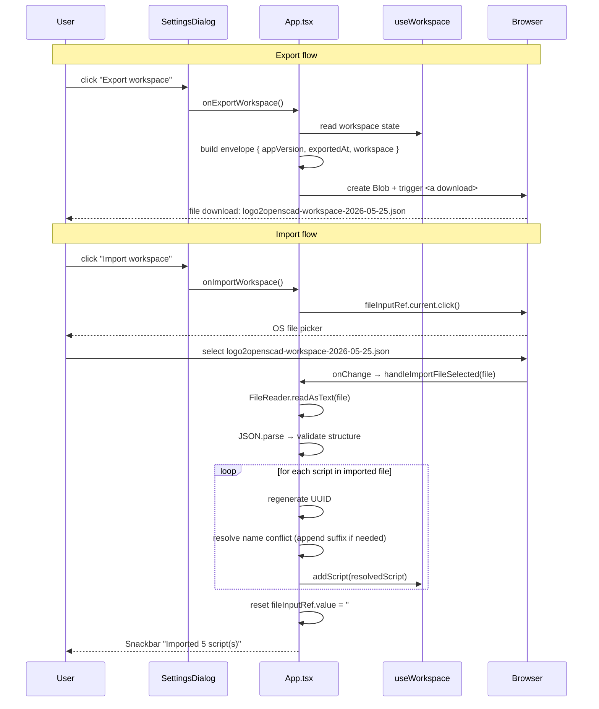

# Workspace Import / Export

## Summary

Add Export and Import buttons to the Settings dialog that let users save their entire workspace to a JSON file and restore it on any browser. Export produces a JSON file containing all scripts plus an envelope with the app version and export timestamp. Import reads such a file and merges its scripts into the current workspace, renaming any incoming scripts whose names clash with existing ones. This solves backup, cross-browser transfer, and version-controlling scripts outside the browser.

## Detailed description

### Export

The user clicks **"Export workspace"** in the Settings dialog. The app immediately:

1. Builds an export envelope:
   ```json
   {
     "appVersion": "1.2.3",
     "exportedAt": 1716891234567,
     "workspace": {
       "version": 1,
       "scripts": [ ... ],
       "activeScriptId": "..."
     }
   }
   ```
   `appVersion` is read from the `__APP_VERSION__` global constant (already defined in `vite.config.ts`). `exportedAt` is `Date.now()`. The `workspace` object is the current workspace state verbatim.

2. Serialises the envelope to a JSON string (pretty-printed with 2-space indent for human readability and diff-friendliness).

3. Creates a `Blob` (`application/json`) and triggers a browser download via a temporary `<a download>` element.

4. The filename is `logo2openscad-workspace-YYYY-MM-DD.json` using today's local date.

No dialog or confirmation is shown — export is immediate and non-destructive.

### Import

The user clicks **"Import workspace"** in the Settings dialog. The app:

1. Programmatically clicks a hidden `<input type="file" accept=".json">` element. No custom file-picker UI is built.

2. When the user selects a file, it is read via the `FileReader` API (`readAsText`).

3. The text is parsed as JSON and validated (see Validation section).

4. Valid scripts are merged into the existing workspace using the merge algorithm below.

5. A success Snackbar shows: **"Imported N script(s)"** (where N is the count of scripts actually added). If N is 0, the message is **"No new scripts were imported"**.

6. On any error, the existing `ErrorSnackbar` pattern is used with a descriptive message.

The Settings dialog does not close automatically after import.

### Merge algorithm

For each script in the imported file:

1. **Regenerate the ID**: generate a fresh UUID via `crypto.randomUUID()` to avoid UUID collisions with existing scripts.
2. **Resolve name conflicts**: if a script with the same name already exists in the current workspace, append ` (imported)` to the incoming name. If `"Name (imported)"` also exists, append ` (imported 2)`, ` (imported 3)`, etc. until a free name is found.
3. **Preserve timestamps**: keep the original `createdAt` and `updatedAt` from the imported script so that provenance is preserved for version-control use cases.
4. **Add to workspace**: append the resolved script to the scripts array. Do not change `activeScriptId` — the user's current script selection is unaffected.

Scripts that fail field validation (missing `name`, `content`, or non-string values) are silently skipped; the success count reflects only scripts that were actually added.

### Settings dialog placement

The export/import buttons are added as a new section at the bottom of `SettingsDialog.tsx`, above the existing action row containing the Close button (and the Reset panel sizes button from the resizable-panels feature). A `<Divider />` separates them from the settings controls above. The section contains:

- A label: **"Workspace"** (`Typography variant="subtitle2"`)
- Two buttons side by side: **"Export workspace"** (`variant="outlined"`) and **"Import workspace"** (`variant="outlined"`)

The hidden `<input type="file">` lives in `App.tsx` (not inside the dialog), so all file-reading logic stays in the component that owns the workspace state.

### File input wiring

`SettingsDialog` receives two props:
- `onExportWorkspace: () => void`
- `onImportWorkspace: () => void`

`App.tsx` creates a `fileInputRef = useRef<HTMLInputElement>(null)` and renders a hidden `<input type="file" accept=".json" style={{ display: 'none' }} ref={fileInputRef} onChange={handleImportFileSelected} />`. `onImportWorkspace` triggers `fileInputRef.current?.click()`. After the import completes, the input value is reset (`fileInputRef.current.value = ''`) so the same file can be re-imported if needed.

## Validation

| Rule | Error message |
|---|---|
| File cannot be read / is empty | "Could not read the file." |
| File is not valid JSON | "The file is not valid JSON." |
| Top-level object missing `workspace` field | "This does not appear to be a logo2openscad export file." |
| `workspace.scripts` is missing or not an array | "The export file contains no scripts array." |
| `scripts` array is empty | No error — show "No new scripts were imported" success message |
| Individual script missing `name` or `content` (string) | Script is silently skipped; counted in a separate skipped total (not surfaced to user unless all scripts were skipped) |
| All scripts skipped (none imported) | "No new scripts were imported." |

## User stories

- As a Logo programmer, I want to export my whole workspace to a JSON file so that I can back it up, share it, or commit it to version control.
- As a Logo programmer, I want to import a workspace JSON file and have its scripts merged into my current workspace so that I can collect scripts from multiple browsers without losing existing work.
- As a returning user, I want name conflicts to be resolved automatically (by renaming incoming scripts) so that I never accidentally overwrite a script I care about.

## Key decisions

| Decision | Outcome |
|---|---|
| Scope | Full workspace export/import only — no individual `.logo` file export or import |
| UI location | Settings dialog — new "Workspace" section at the bottom |
| Export trigger | Immediate browser download; no confirmation dialog |
| Import mode | Merge into existing workspace — never replaces or clears current scripts |
| Name conflict resolution | Incoming script renamed with ` (imported)` suffix (incrementing if needed) |
| ID handling on import | Always regenerate UUIDs to avoid collision with existing scripts |
| Timestamp handling on import | Preserve original `createdAt` / `updatedAt` for version-control traceability |
| Active script on import | Unchanged — user's current script selection is not affected |
| App version in export | Included in envelope as `appVersion` for future backwards-compatibility use |
| Export filename | `logo2openscad-workspace-YYYY-MM-DD.json` using local date at export time |
| File input element | Hidden `<input type="file">` in `App.tsx`; dialog just calls the callback |
| Error handling | Uses existing `ErrorSnackbar` pattern |
| Success feedback | Snackbar: "Imported N script(s)" or "No new scripts were imported" |

## Diagrams



```mermaid
flowchart TD
    F[Read file] --> P{Valid JSON?}
    P -- No --> E1[Error: not valid JSON]
    P -- Yes --> V{Has workspace.scripts array?}
    V -- No --> E2[Error: not a logo2openscad export]
    V -- Yes --> L[Loop over scripts]
    L --> S{Script has name + content?}
    S -- No --> SK[Skip silently]
    S -- Yes --> N{Name exists in workspace?}
    N -- No --> ADD[Add with new UUID]
    N -- Yes --> RN[Rename: append '(imported)']
    RN --> ADD
    ADD --> L
    SK --> L
    L --> D{Any added?}
    D -- Yes --> SUC["Snackbar: Imported N script(s)"]
    D -- No --> NON[Snackbar: No new scripts were imported]
```

## Acceptance criteria

```gherkin
Feature: Workspace export

  Background:
    Given the application is loaded with several scripts in the workspace

  Scenario: Export button appears in Settings dialog
    When the user opens the Settings dialog
    Then a "Workspace" section is visible near the bottom
    And an "Export workspace" button is present

  Scenario: Export triggers an immediate file download
    When the user clicks "Export workspace"
    Then a file download begins immediately
    And the filename matches the pattern "logo2openscad-workspace-YYYY-MM-DD.json"
    And the Settings dialog remains open

  Scenario: Exported file contains all scripts
    Given the workspace has 3 scripts named "Alpha", "Beta", "Gamma"
    When the user exports the workspace
    Then the downloaded JSON contains all 3 scripts with their names and content

  Scenario: Exported file contains the app version and export timestamp
    When the user exports the workspace
    Then the downloaded JSON has a top-level "appVersion" field
    And a top-level "exportedAt" field containing a Unix timestamp

Feature: Workspace import

  Background:
    Given the application is loaded with existing scripts

  Scenario: Import button appears in Settings dialog
    When the user opens the Settings dialog
    Then an "Import workspace" button is present in the Workspace section

  Scenario: Import opens a file picker
    When the user clicks "Import workspace"
    Then the OS file picker opens filtered to .json files

  Scenario: Valid import merges scripts into existing workspace
    Given the workspace contains a script "Existing"
    And the import file contains scripts "Alpha" and "Beta"
    When the user imports the file
    Then the workspace now contains "Existing", "Alpha", and "Beta"
    And the active script is unchanged

  Scenario: Name conflict appends imported suffix
    Given the workspace contains a script named "Alpha"
    And the import file also contains a script named "Alpha"
    When the user imports the file
    Then the workspace contains the original "Alpha"
    And a new script named "Alpha (imported)"

  Scenario: Incremental suffix if both names clash
    Given the workspace contains "Alpha" and "Alpha (imported)"
    And the import file contains a script named "Alpha"
    When the user imports the file
    Then a new script named "Alpha (imported 2)" is added

  Scenario: Success snackbar shows count of imported scripts
    Given the import file contains 4 valid scripts
    When the user imports the file
    Then a snackbar shows "Imported 4 script(s)"

  Scenario: Importing the same file twice does not overwrite scripts
    Given the user has imported a file containing "Alpha"
    When the user imports the same file again
    Then a second script "Alpha (imported)" is added
    And the first "Alpha" is unchanged

  Scenario: Import with no valid scripts shows informational message
    Given the import file contains an empty scripts array
    When the user imports the file
    Then a snackbar shows "No new scripts were imported"
    And the workspace is unchanged

  Scenario: Invalid JSON shows error
    When the user imports a file that is not valid JSON
    Then an error snackbar shows "The file is not valid JSON."
    And the workspace is unchanged

  Scenario: Non-export JSON file shows error
    When the user imports a valid JSON file without a "workspace" field
    Then an error snackbar shows "This does not appear to be a logo2openscad export file."

  Scenario: Individual invalid scripts are skipped silently
    Given the import file contains one valid script and one script missing the "content" field
    When the user imports the file
    Then only the valid script is added
    And the snackbar shows "Imported 1 script(s)"

  Scenario: File input is reset after import
    When the user imports a file
    And then clicks "Import workspace" again
    Then the file picker opens again (not pre-selected with the previous file)
```

## Manual test steps

1. Open the Settings dialog. Confirm a "Workspace" section appears near the bottom with "Export workspace" and "Import workspace" buttons.

**Export:**

2. Click "Export workspace". Confirm a file download begins immediately and the Settings dialog stays open.
3. Open the downloaded file in a text editor. Confirm it is pretty-printed JSON with `appVersion`, `exportedAt`, and `workspace` fields at the top level.
4. Confirm `workspace.scripts` contains all scripts from the current workspace with their names and content intact.
5. Confirm the filename follows the pattern `logo2openscad-workspace-YYYY-MM-DD.json` with today's date.

**Import — happy path:**

6. Create a second browser profile (or a fresh private window). Open the app there. Confirm it has an empty or different workspace.
7. Import the previously exported file. Confirm all scripts from the first workspace appear in the second browser.
8. Confirm the original scripts in the second browser are still present (merge, not replace).
9. Confirm the active script did not change after import.
10. Confirm the snackbar shows "Imported N script(s)" with the correct count.

**Import — conflicts:**

11. Import the same file into the original browser (which already has those scripts). Confirm each script is added with ` (imported)` appended to its name, and no existing script is overwritten.
12. Import the file a third time. Confirm scripts are now named ` (imported 2)`.

**Import — errors:**

13. Create a plain text file (not JSON) and try to import it. Confirm the error snackbar shows "The file is not valid JSON."
14. Create a valid JSON file with content `{}` (no `workspace` field) and import it. Confirm the error snackbar shows "This does not appear to be a logo2openscad export file."

**Re-import:**

15. After a successful import, click "Import workspace" again. Confirm the file picker opens fresh (no pre-selected file from last time).

## Implementation tasks

Tasks must be completed in order.

1. **Add `mergeImportedScripts` to `useWorkspace`** (`src/hooks/useWorkspace.ts`):
   - Add a new exported function `mergeImportedScripts(importedScripts: Partial<LogoScript>[]): number`:
     - Takes an array of raw script objects from the import file (typed loosely since they're unvalidated)
     - For each entry: validate `name` and `content` are non-empty strings; skip if not
     - Resolve name conflicts against the current workspace scripts using the suffix algorithm (`(imported)`, `(imported 2)`, …)
     - Generate a new UUID with `crypto.randomUUID()`; preserve original `createdAt`/`updatedAt` or fall back to `Date.now()`
     - Append each resolved script to `workspace.scripts` via the existing `setWorkspace` state setter
     - Return the count of scripts actually added

2. **Add export and import handlers in `App.tsx`**:
   - Add `handleExportWorkspace()`:
     - Build the envelope: `{ appVersion: __APP_VERSION__, exportedAt: Date.now(), workspace }`
     - `JSON.stringify(envelope, null, 2)` → `new Blob([json], { type: 'application/json' })`
     - Create a temporary `<a>` element with `href = URL.createObjectURL(blob)` and `download = 'logo2openscad-workspace-YYYY-MM-DD.json'` (format date using `new Date().toISOString().slice(0, 10)`)
     - Append to body, click, then remove and revoke the object URL
   - Add `fileInputRef = useRef<HTMLInputElement>(null)`
   - Add `handleImportFileSelected(e: React.ChangeEvent<HTMLInputElement>)`:
     - Read `e.target.files?.[0]`; return if none
     - `FileReader.readAsText(file)` → on `onload`, run the validation + merge flow
     - Validate JSON parse; validate `workspace` and `workspace.scripts` fields; call `mergeImportedScripts`
     - Show success or error Snackbar via existing state patterns
     - Reset `fileInputRef.current.value = ''`
   - Add `handleImportWorkspace()`: calls `fileInputRef.current?.click()`
   - Render `<input type="file" accept=".json" style={{ display: 'none' }} ref={fileInputRef} onChange={handleImportFileSelected} />` inside the App JSX (outside any dialog)

3. **Update `SettingsDialog.tsx`** (`src/components/SettingsDialog.tsx`):
   - Add `onExportWorkspace: () => void` and `onImportWorkspace: () => void` to the props interface
   - Add a new section at the bottom of `DialogContent`, above the existing controls divider:
     - `<Divider sx={{ my: 2 }} />`
     - `<Typography variant="subtitle2">Workspace</Typography>`
     - `<Stack direction="row" spacing={1} sx={{ mt: 1 }}>`
     - `<Button variant="outlined" onClick={props.onExportWorkspace}>Export workspace</Button>`
     - `<Button variant="outlined" onClick={props.onImportWorkspace}>Import workspace</Button>`

4. **Wire props from `App.tsx` to `<SettingsDialog>`** (`src/App.tsx`, where `<SettingsDialog>` is rendered):
   - Pass `onExportWorkspace={handleExportWorkspace}` and `onImportWorkspace={handleImportWorkspace}`

5. **Manual smoke test** — follow the manual test steps above, covering export, merge import, conflict renaming, and all error cases.
