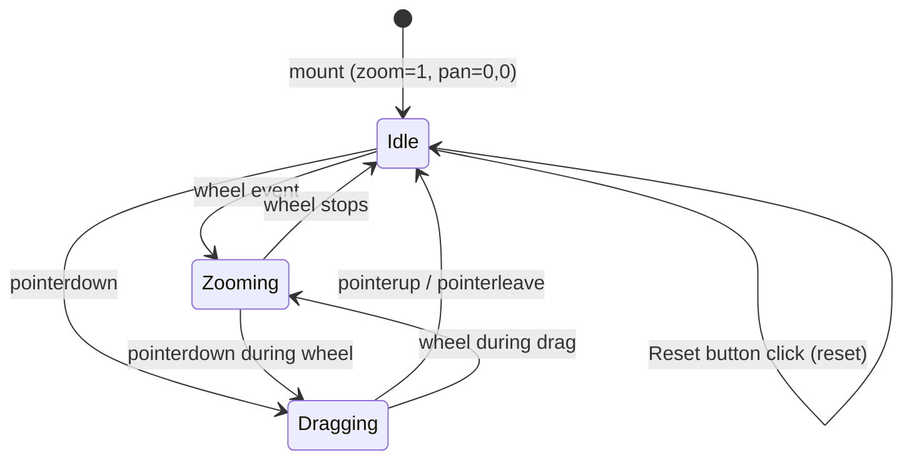

# Zoom and Pan in Preview

## Summary

Mouse-wheel to zoom and drag to pan the preview canvas. The current auto-fit is great for full views, but zooming into a dense area to inspect detail is awkward without it. Zoom and pan are preserved when script content changes, so you can watch edits land in the area you're inspecting. Double-clicking the canvas or clicking a toolbar button resets to auto-fit.

## Detailed description

### Zoom

Scrolling the mouse wheel over the canvas zooms in or out centred on the cursor position — the world point under the cursor stays fixed as the zoom level changes. Zoom is applied multiplicatively on top of the existing auto-fit scale, so zoom level 1.0 means "exactly auto-fit". Zoom is clamped to a sensible range (minimum ~0.1×, maximum ~50×).

### Pan

Clicking and dragging the canvas pans the view. The cursor changes to a grab cursor while hovering and a grabbing cursor during drag. Dragging is additive: the offset accumulates across drags.

### State preservation

Zoom and pan are preserved in component state. When the active script changes or its content updates (segments change), the current zoom and pan are kept — this lets users inspect how their edits affect a specific detail area without losing their view.

### Reset

Two reset paths return the view to the default auto-fit state (zoom 1.0, pan 0,0):
- **Double-click** anywhere on the canvas.
- **"Reset zoom" button** in the Preview toolbar, visible only when zoom or pan differ from the default.

### Interaction with animation

Zoom and pan are fully active during animation playback. Dragging during playback does not pause the animation.

### Hover / hit detection

The `findHoveredSegment` hit detection currently calls `createPreviewLayout()` independently to find segment positions. With zoom and pan, it must use the same zoom/pan state so that hover positions match the rendered positions. The hit radius (8 px in screen space) does not need to change — screen-pixel distances are unaffected by the coordinate transform.

### Coordinate transform

The current auto-fit transform (`createPreviewLayout`) produces:
```
screenX = centerX + (worldX − midX) × scale
screenY = centerY − (worldY − midY) × scale
```

With zoom `z` and pan offset `(px, py)`, this becomes:
```
screenX = centerX + (worldX − midX) × scale × z + px
screenY = centerY − (worldY − midY) × scale × z + py
```

When zooming at cursor position `(cx, cy)` from zoom `z` to `z′`, pan is adjusted to keep the world point under the cursor fixed:
```
ratio  = z′ / z
newPx  = (cx − centerX) × (1 − ratio) + px × ratio
newPy  = (cy − centerY) × (1 − ratio) + py × ratio
```

All cursor positions must be converted from CSS pixels to canvas pixel space using `getBoundingClientRect` and `devicePixelRatio`, consistent with the existing `handlePointerMove` implementation.

## User stories

- As a user, I want to zoom into a dense region of the preview so that I can inspect fine detail without leaving the app.
- As a user, I want to pan the canvas so that I can navigate to any part of the drawing after zooming in.
- As a user, I want zoom and pan to persist while I edit the script so that I can watch a specific area change in real time.
- As a user, I want a quick way to reset to the full view so that I can get back to the overview after inspecting detail.

## Key decisions

| Decision | Outcome |
|---|---|
| Zoom/pan preserved on content change | Yes — zoom and pan survive segment updates so users can inspect a detail area while editing. |
| Reset mechanism | Both a double-click on canvas and a toolbar button. Toolbar button only visible when not at default. |
| Touch support | Not in scope — mouse only (wheel to zoom, drag to pan). |
| Zoom during animation | Allowed — panning or zooming does not pause playback. |
| Zoom centre | Cursor position — the world point under the cursor stays fixed during zoom. |
| Hit radius | Unchanged at 8 px screen space — no adjustment needed since hit detection operates post-transform. |
| Zoom limits | Min 0.1×, max 50× the auto-fit scale. |
| Drag cursor | `grab` while hovering canvas; `grabbing` while dragging. |

## Diagrams



## Acceptance criteria

```gherkin
Feature: Zoom in preview

  Scenario: Wheel-zoom in centres on cursor
    Given the preview has segments and zoom is at default
    When the user scrolls the mouse wheel up over a point on the canvas
    Then the canvas zooms in
    And the world point that was under the cursor remains under the cursor

  Scenario: Wheel-zoom out centres on cursor
    Given the preview is zoomed in
    When the user scrolls the mouse wheel down
    Then the canvas zooms out
    And the world point under the cursor remains under the cursor

  Scenario: Zoom is clamped at minimum
    Given the preview is at minimum zoom (0.1×)
    When the user scrolls down further
    Then the zoom level does not decrease below 0.1×

  Scenario: Zoom is clamped at maximum
    Given the preview is at maximum zoom (50×)
    When the user scrolls up further
    Then the zoom level does not increase above 50×

Feature: Pan in preview

  Scenario: Dragging pans the view
    Given the preview is zoomed in
    When the user clicks and drags the canvas to the right
    Then the drawing moves to the right by the same amount

  Scenario: Cursor changes during drag
    Given the preview canvas is visible
    When the user hovers over the canvas
    Then the cursor is "grab"
    When the user holds the mouse button down
    Then the cursor is "grabbing"
    When the user releases the mouse button
    Then the cursor returns to "grab"

  Scenario: Pan does not pause animation
    Given the animation is playing
    When the user drags the canvas
    Then the animation continues to play

Feature: Zoom/pan state preservation

  Scenario: State survives script content change
    Given the user has zoomed in to a specific area
    When the script content changes and segments update
    Then the zoom level and pan offset are unchanged

  Scenario: State survives switching between scripts (each script independent)
    Given script A is active with zoom 3× and a pan offset
    When the user switches to script B
    Then script B shows at its own zoom/pan state (default if never zoomed)
    When the user switches back to script A
    Then script A restores its zoom 3× and pan offset

Feature: Reset zoom and pan

  Scenario: Double-click resets to auto-fit
    Given the preview is zoomed in and panned
    When the user double-clicks the canvas
    Then zoom resets to 1.0 and pan resets to (0, 0)
    And the drawing fits the canvas as it did on load

  Scenario: Reset button resets to auto-fit
    Given the preview is zoomed in
    When the user clicks the "Reset zoom" button in the Preview toolbar
    Then zoom resets to 1.0 and pan resets to (0, 0)

  Scenario: Reset button hidden at default state
    Given zoom is 1.0 and pan is (0, 0)
    Then the "Reset zoom" button is not visible in the toolbar

  Scenario: Reset button visible when zoomed or panned
    Given the user has zoomed or panned
    Then the "Reset zoom" button is visible in the toolbar

Feature: Hover hit detection with zoom/pan

  Scenario: Hover tooltip appears correctly when zoomed in
    Given the preview is zoomed in and panned
    When the user hovers over a rendered segment
    Then the hover tooltip appears at the correct screen position
    And the source line number shown is correct
```

## Manual test steps

1. Open the app with a script that produces several segments.
2. Hover over the canvas — verify the cursor is a grab hand.
3. Scroll the mouse wheel up over the centre of the canvas — verify the drawing zooms in centred on the canvas centre.
4. Scroll while the cursor is over a specific point (e.g. a corner of the drawing) — verify that point stays fixed as zoom changes.
5. Click and drag the canvas — verify the drawing follows the cursor. Verify the cursor changes to a grabbing hand during drag.
6. Release the mouse — verify the drawing stays in the new position.
7. Hover over a segment after zooming in — verify the hover tooltip appears and shows the correct source line.
8. Double-click the canvas — verify zoom and pan reset to auto-fit instantly.
9. Zoom in again. Check the Preview toolbar — verify a "Reset zoom" button is now visible. Click it — verify view resets.
10. Return to default (auto-fit) — verify the "Reset zoom" button disappears from the toolbar.
11. Zoom in, then edit the script (change a command) — verify zoom and pan are preserved after the preview re-renders.
12. Zoom in on script A. Switch to script B — verify it opens at auto-fit. Switch back to script A — verify the zoom and pan from step 12 are restored.
13. Start the animation and pan/zoom while it plays — verify the animation continues without pausing.
14. Zoom all the way in until zoom stops changing — verify the maximum limit is respected. Zoom all the way out — verify the minimum limit is respected.

## Implementation tasks

1. **Extend `createPreviewLayout()` in `src/logo/drawPreview.ts` to accept zoom and pan**
   - Add optional parameters `zoom: number = 1` and `pan: { x: number; y: number } = { x: 0, y: 0 }`.
   - Update the `toScreen` return function to apply them:
     `x = centerX + (p.x - midX) * scale * zoom + pan.x`
     `y = centerY - (p.y - midY) * scale * zoom + pan.y`
   - All existing callers with no zoom/pan arguments continue to work unchanged.

2. **Add zoom and pan state to `Preview.tsx`**
   - Add state: `zoom: number` (initial 1), `pan: { x: number; y: number }` (initial `{ x: 0, y: 0 }`), `isDragging: boolean`, `dragStart: { x: number; y: number }`.
   - Per-script state: if zoom/pan should survive script switches, store a `Map<scriptId, { zoom, pan }>` and restore/save on `activeScriptId` change. If per-script isolation isn't required initially, simple component state suffices.
   - Add a helper `toCavasCoords(e: React.PointerEvent)` mirroring the existing `getBoundingClientRect` + `devicePixelRatio` logic in `handlePointerMove`.

3. **Wire zoom and pan into the draw and hover calls**
   - Pass `zoom` and `pan` to `createPreviewLayout()` in the `useEffect` that calls `drawPreview()`.
   - Pass `zoom` and `pan` to the `createPreviewLayout()` call inside `findHoveredSegment` so hover positions match rendered positions.

4. **Add wheel handler for zoom**
   - Attach `onWheel` to the canvas element in `Preview.tsx`.
   - Compute `newZoom = clamp(zoom * (1 + delta * 0.001), 0.1, 50)` (tune the sensitivity constant).
   - Convert `e.clientX/Y` to canvas pixel coords; compute adjusted pan using the formula from the Detailed description section.
   - Call `setZoom(newZoom)` and `setPan(newPan)`.
   - Call `e.preventDefault()` to suppress page scroll; add `{ passive: false }` to the wheel listener (requires using `addEventListener` directly, or a `useEffect` ref-based handler, since React synthetic events are passive by default).

5. **Add drag handlers for pan**
   - `onPointerDown`: set `isDragging = true`, record `dragStart` in canvas pixel coords, call `e.currentTarget.setPointerCapture(e.pointerId)` to track drag outside the element.
   - `onPointerMove`: if `isDragging`, compute delta from `dragStart` to current position, update `pan` by the delta, update `dragStart` to current position.
   - `onPointerUp` / `onPointerLeave`: set `isDragging = false`.
   - Set `cursor: isDragging ? 'grabbing' : 'grab'` on the canvas style.

6. **Add double-click handler for reset**
   - `onDoubleClick` on the canvas: set `zoom = 1`, `pan = { x: 0, y: 0 }`.

7. **Add "Reset zoom" toolbar button**
   - In the Preview toolbar (alongside Play/Pause in `Preview.tsx` lines 132–169), add an icon button (e.g. `ZoomOutMapIcon` or `FitScreenIcon` from MUI icons).
   - Visible only when `zoom !== 1 || pan.x !== 0 || pan.y !== 0`.
   - On click: reset zoom and pan to defaults.
   - Follow the existing MUI `IconButton` pattern used by Play/Pause buttons.
